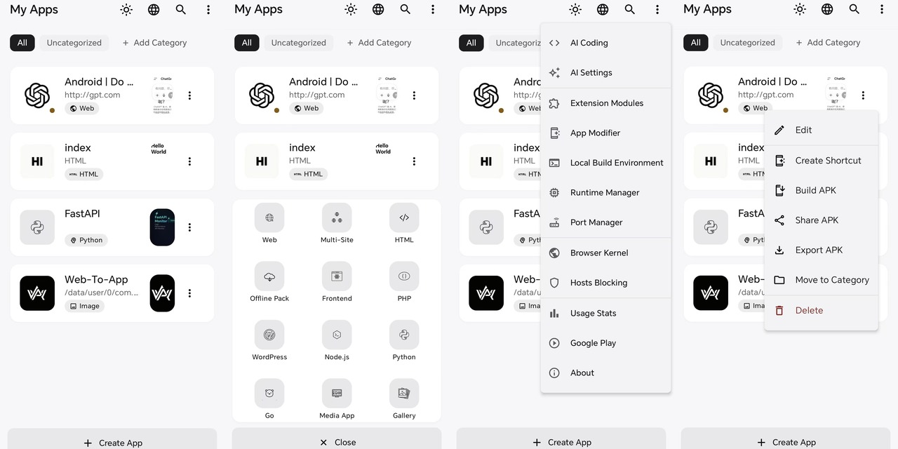

<div align="center">


# WebToApp

### Build Android APKs from web projects, directly on your phone.

**WebToApp is an on-device APK builder for websites, HTML apps, media projects, and local server runtimes.**
Turn a URL, a project folder, or a media library into an installable Android app you can preview, sign, install, share, or export without sending the build to a remote service.

**English** · [简体中文](README_CN.md)

[](https://github.com/shiaho777/web-to-app/stargazers)
[](https://github.com/shiaho777/web-to-app/network/members)
[](LICENSE)
[](#)

</div>

<p align="center">
  <a href="#why-webtoapp">Why WebToApp</a> ·
  <a href="#what-you-can-build">What you can build</a> ·
  <a href="#highlights">Highlights</a> ·
  <a href="#module-market">Module Market</a> ·
  <a href="#feature-map">Feature map</a> ·
  <a href="#build-from-source">Build</a>
</p>

---

<div align="center">

</div>

---

## Why WebToApp

Most "website to app" tools stop at wrapping a URL. WebToApp is closer to a pocket-sized APK workshop: it combines a configurable WebView, local server runtimes, APK signing, extension modules, project import/export, and app management in one Android app.

- **Build on the device** - package and sign APKs inside the app, with no remote build queue.
- **Go beyond static pages** - package websites, HTML/front-end builds, Node.js, PHP, Python, Go, WordPress, media apps, galleries, and multi-site apps.
- **Keep control of the output** - choose package name, icon, permissions, signing key, signature schemes, runtime options, and export format.
- **Extend after shipping** - add JS/CSS modules, userscripts, or MV3 Chrome extensions without rebuilding the host app.
- **Stay inspectable** - the Android client, module catalog, and build logic live in this repository.

## What You Can Build

| Input | Output | Useful for |
| --- | --- | --- |
| Website URL | WebView-based APK | Landing pages, tools, dashboards, documentation, internal systems |
| HTML / static front-end | Localhost-backed APK | React, Vue, Vite, static builds, offline web apps |
| Node.js / PHP / Python / Go | APK with an on-device local server | Small server apps, admin tools, demos, prototypes |
| WordPress | APK running WordPress over local PHP + SQLite | Portable sites, theme/plugin demos, local content packages |
| Images / video / galleries | Media-focused APK | Albums, course materials, portfolios, offline viewers |
| Multiple sites | Tab/card/feed/drawer multi-web APK | Link hubs, portals, app collections |
| Installed APK | Rebranded clone or shortcut disguise | Icon/name/package experiments and app repackaging research |

Supported `AppType` values include Web, HTML, Frontend, WordPress, Node.js, PHP, Python, Go, Image, Video, Gallery, and Multi-Web.

## The Flow

1. **Create** an app from a URL, project folder, media set, or local runtime template.
2. **Customize** the WebView, toolbar, splash screen, modules, permissions, signing, and runtime behavior.
3. **Preview** on the phone before producing the final APK.
4. **Build and sign** the APK on-device through `com.android.tools.build:apksig`.
5. **Install, share, export, or back up** the generated app and its project data.

## Highlights

| Area | What stands out |
| --- | --- |
| APK builder | Binary AXML/ARSC patching, resource injection, permission pruning, V1/V2/V3 signing, AAB metadata generation |
| WebView control | User-Agent, desktop mode, JS/CSS injection, DNS-over-HTTPS, proxies, custom error pages, PWA cache strategy |
| Browser engines | System WebView by default, optional GeckoView runtime for Firefox-style rendering |
| Local runtimes | Node.js, PHP 8.4, Python, Go, and WordPress running through local HTTP servers |
| Extensions | Built-in modules, userscripts with `GM_*` APIs, MV3 Chrome extension content scripts, QR/export-code sharing |
| Privacy and hardening | Ad blocking, resource encryption, runtime checks, WebView isolation, activation code gating |
| App experience | Splash screens, BGM/LRC lyrics, floating windows, status bar themes, notifications, deep links, usage stats |
| AI Coding | Prompt-driven generation for web apps, extension modules, and runtime projects inside the mobile workflow |

## Get The App

Releases are published on [GitHub Releases](https://github.com/shiaho777/web-to-app/releases).

WebToApp intentionally keeps `targetSdk = 28` so generated apps can run native binaries from app storage, similar to Termux. That makes GitHub distribution a better fit than Google Play for now.

## Module Market

WebToApp has a GitHub-backed module market for community JS/CSS extensions. The catalog is just files in this repository, so contributions use a normal pull request flow.

```
modules/
├── registry.json        # app-facing catalog
├── submissions.json     # CI-generated PR / submitter metadata
├── README.md            # contributor guide
├── hello-world/
├── night-shift/
├── reading-mode/
├── floating-search/
└── auto-scroll/
```

The app fetches both `registry.json` and `submissions.json`, and only shows modules that appear in both. That keeps the in-app catalog aligned with PRs that have actually been merged.

- Users open **Extension Modules** and tap the storefront icon.
- Contributors add a folder under `modules/`, update `registry.json`, and open a PR.
- The default client cache is one hour, so merged modules propagate without an app update.

[Module contributor guide](modules/README.md) · [General contributing guide](CONTRIBUTING.md)

## Feature Map

The full app has many switches. The sections below group the important ones without making the top of the README feel like a settings dump.

<details>
<summary><b>Browser engine and networking</b></summary>

- Desktop mode, custom User-Agent, and JS/CSS injection at document start, end, or idle.
- Kernel flavor disguise for Chrome, Edge, Samsung Internet, Firefox, or Safari-style presentation while keeping the real engine unchanged.
- Popup handling: same window, external browser, popup window, or block.
- Static HTTP/HTTPS/SOCKS5 proxies, PAC proxies, authentication, bypass rules, and a local HTTP-to-SOCKS bridge.
- DNS-over-HTTPS providers: Cloudflare, Google, AdGuard, NextDNS, CleanBrowsing, Quad9, Mullvad, plus custom endpoints.
- PWA offline cache strategies, custom error pages, per-app hosts overrides, and payment scheme handlers.
- Optional compatibility toggles for blob downloads, scroll memory, image repair, clipboard, orientation, notification polyfills, private network bridging, and Native Bridge capability gates.

</details>

<details>
<summary><b>Extensions and automation</b></summary>

- Built-in modules: video download, Bilibili/Douyin/Xiaohongshu extractors, video enhancer, web analyzer, find-in-page, dark mode, privacy tools, content enhancer, and element blocker.
- Userscript support for Greasemonkey/Tampermonkey-style `.user.js` scripts.
- `GM_*` bridge with storage, requests, styles, menu commands, and promise-based `GM.*` APIs based on script grants.
- MV3 Chrome extension runtime for manifest-based content scripts in isolated or main worlds.
- `chrome.*` polyfills for runtime, storage, tabs, scripting, and declarative network request parsing.
- Export codes (`WTA1:` gzip + Base64) and QR sharing through ZXing.
- AI Coding skills for generating modules, userscripts, MV3 extensions, front-end apps, and local runtime projects.

</details>

<details>
<summary><b>On-device runtimes</b></summary>

- **Node.js** runs in a dedicated `:nodejs` OS process through a native `node_launcher` wrapper that loads `libnode.so`.
- **PHP** uses PHP 8.4 from `pmmp/PHP-Binaries`, downloaded once on first use, with Composer support.
- **Python** supports Flask, Django, FastAPI via uvicorn, Tornado, a built-in HTTP server, and pip dependencies in `.pypackages`.
- **Go** supports on-device `go build`, `vendor/` offline builds, static serving, and the native `go_exec_loader` wrapper.
- **WordPress** runs on local PHP with SQLite through `sqlite-database-integration`, with theme and plugin import.
- A Linux Environment screen manages toolchains and dependencies for Node, PHP, and Python.
- Port Manager coordinates runtime ports across generated apps through broadcast receivers.

</details>

<details>
<summary><b>App experience</b></summary>

- Image or video splash screens with skip behavior, trim ranges, and fixed orientation.
- Background music playlists with synced LRC lyrics, lyric animations, custom font/color/stroke/shadow, and online music search.
- Toolbar, status bar, dark-mode status bar, navigation behavior, floating window mode, and long-press menu styles.
- Announcement templates for launch, interval, and no-network moments.
- Translation overlay with 20 target languages and Google, MyMemory, LibreTranslate, Lingva, or Auto engines.
- Web Notification polyfill, URL polling foreground service, deep links, boot auto-start, scheduled launch, and background-run service.
- Per-app usage stats with Vico charts and URL health monitoring.

</details>

<details>
<summary><b>Security, privacy, and controlled access</b></summary>

- Resource encryption for packaged config, HTML, media, and BGM through PBKDF2 + AES-256-GCM.
- Optional custom encryption password for stronger protection than package/certificate-derived defaults.
- Runtime anti-debug, anti-Frida, and DEX-tamper checks when resource encryption is enabled.
- Threat responses: log only, silent exit, or randomized crash.
- WebView/content isolation for storage, WebRTC, Canvas, Audio, WebGL, fonts, headers, and IP surfaces.
- Browser fingerprint disguise across 28 vectors, including UA, WebGL, Canvas, AudioContext, ClientRects, timezone, language, memory, media devices, WebRTC, fonts, battery, permissions, performance, storage, notifications, CSS media, iframe propagation, and error stack cleanup.
- Hosts-rule ad blocker with cosmetic MutationObserver filtering and 23 built-in community filter lists.
- Activation code gating with local verification or your own HTTPS endpoint signed with EC P-256. See [remote activation docs](docs/remote-activation.md).

</details>

<details>
<summary><b>APK export and signing</b></summary>

- Custom package name, `versionName`, `versionCode`, icon, label, architecture target, and export format.
- Build-time permission injection for the generated APK, with unused permissions pruned from the template manifest.
- Performance options: image compression, WebP conversion, code minification, lazy loading, DNS prefetch, and preload hints.
- Full project backup/restore and app data backup/restore.
- On-device AAB export with protobuf metadata generated locally.
- Keystore creation, import, export, deletion, and certificate fingerprint viewing.
- PKCS12/PFX/JKS/BKS import, including Android Studio upload-key cases where store password and key password differ.
- Signature scheme controls for V1, V2, and V3, with auto-fallback for legacy certificate compatibility.
- Custom V1 signature filename for `META-INF/<name>.SF` and `META-INF/<name>.RSA`.

</details>

<details>
<summary><b>Specialized tools and research features</b></summary>

- Website Scraper for offline packs: HTML, CSS, JS, images, fonts, CSS `url()`, `srcset`, `@import`, path rewriting, same-domain limits, depth limits, and size limits.
- Multi-Web layouts: tabs, cards, feeds, drawers, per-site icons, theme colors, extraction selectors, refresh intervals, and shared JS/CSS.
- Gallery apps with categorized media, grid/list/timeline views, shuffle/single-loop playback, sorting, thumbnail bar, overlays, auto-next, and playback memory.
- App Modifier for shortcut disguise or real binary clone with manifest/resource patching and re-signing.
- Forced-run, BlackTech, device disguise, and Icon Storm features are included for technical demonstration and must only be used with informed user consent.

</details>

## Architecture Notes

- The repository has two Gradle modules: `app` is the full builder and host; `shell` is the runtime host embedded into generated APKs.
- Runtime code is authored in `app` and synchronized into `shell`, so shared WebView/runtime behavior has one source of truth.
- The APK builder patches template APKs at the binary AXML/ARSC level, injects config/resources, prunes permissions, and signs with `apksig`.
- The host keeps `targetSdk = 28` intentionally so local native runtimes can `fork` and `exec` from app storage.
- Server runtimes and optional GeckoView native runtime are downloaded on first use instead of bundled into the base APK.

## Tech Stack

- Kotlin, Jetpack Compose, Material 3
- Koin for dependency injection
- Room 2.7.2 + KSP for persistence
- OkHttp 4.12.0 + `okhttp-dnsoverhttps`
- `com.android.tools.build:apksig` 8.3.0 for APK signing
- `protobuf-javalite` 3.25.5 for AAB metadata
- GeckoView as an optional browser engine
- Coil for image/video/GIF loading
- AndroidX Security Crypto + DataStore for stored secrets
- Vico Compose-M3 for charts
- ZXing for QR sharing
- Apache Commons Compress + xz for project import and website scraping
- Native C++ through JNI for `node_launcher` and `go_exec_loader`
- Robolectric for unit tests

See [app/build.gradle.kts](app/build.gradle.kts) for the complete dependency list.

## Build From Source

Requirements: Android Studio Hedgehog or newer, JDK 17. The Gradle wrapper pins Gradle 9.4.1.

```bash
git clone https://github.com/shiaho777/web-to-app.git
cd web-to-app
./gradlew assembleDebug
```

For release builds, configure signing through `local.properties` and `app/build.gradle.kts`.

## Contributing

| Lane | What you do | Guide |
| --- | --- | --- |
| `modules/` | Publish a community module to the in-app market | [modules/README.md](modules/README.md) |
| Issues | Report a bug or request a feature | [GitHub Issues](https://github.com/shiaho777/web-to-app/issues) |
| Code | Fix a bug or build a feature in the Android client | [CONTRIBUTING.md](CONTRIBUTING.md) |

## Contact

Developed by **shiaho**.

| Platform | Link |
| --- | --- |
| GitHub | [github.com/shiaho777/web-to-app](https://github.com/shiaho777/web-to-app) |
| Telegram | [t.me/webtoapp777](https://t.me/webtoapp777) |
| X (Twitter) | [@shiaho777](https://x.com/shiaho777) |
| Bilibili | [b23.tv/8mGDo2N](https://b23.tv/8mGDo2N) |
| QQ Group | 1041130206 |

## License

[The Unlicense](LICENSE).

Advanced features such as forced run, BlackTech, device disguise, and Icon Storm are intended for technical demonstration and must only be used with informed user consent.

<div align="center">

**Open source · Built for Android power users · Star to support the project**

</div>
