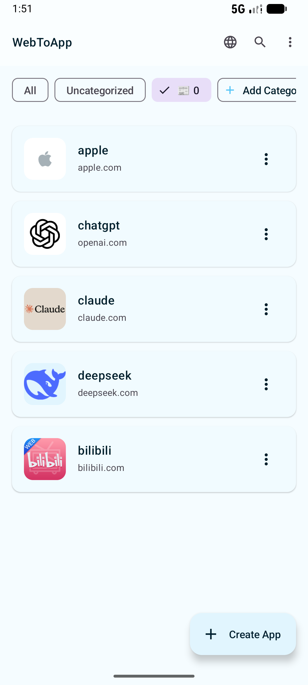
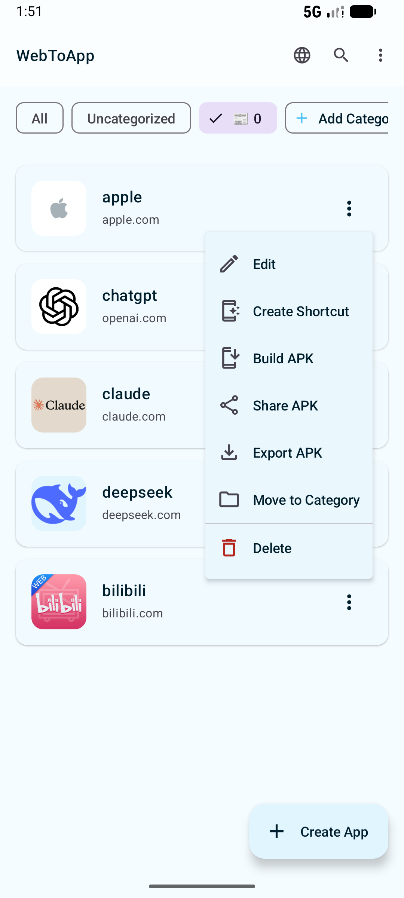
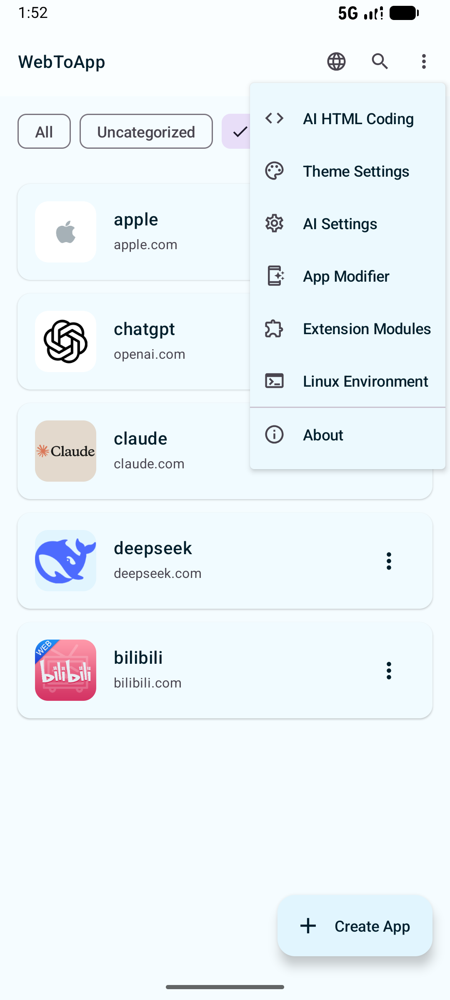
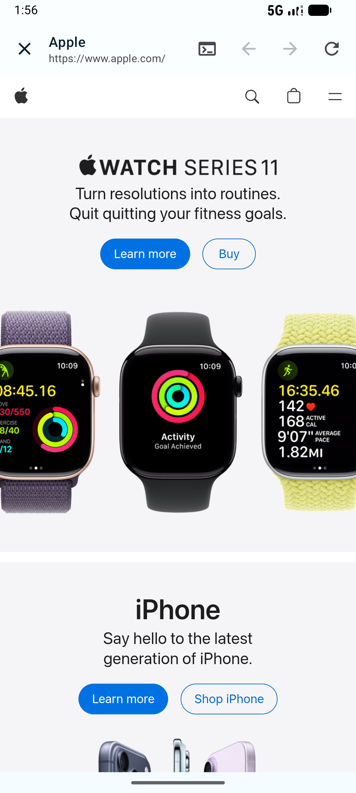
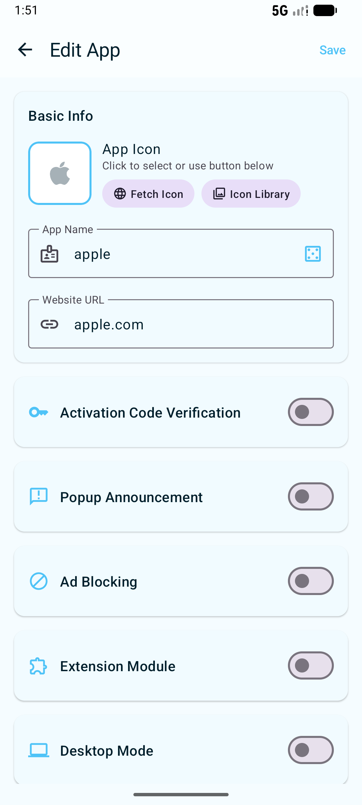
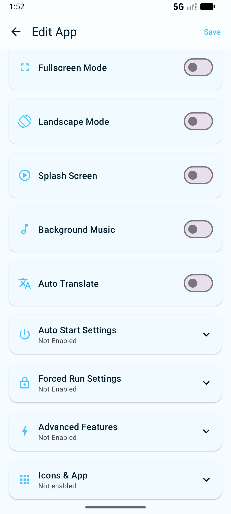
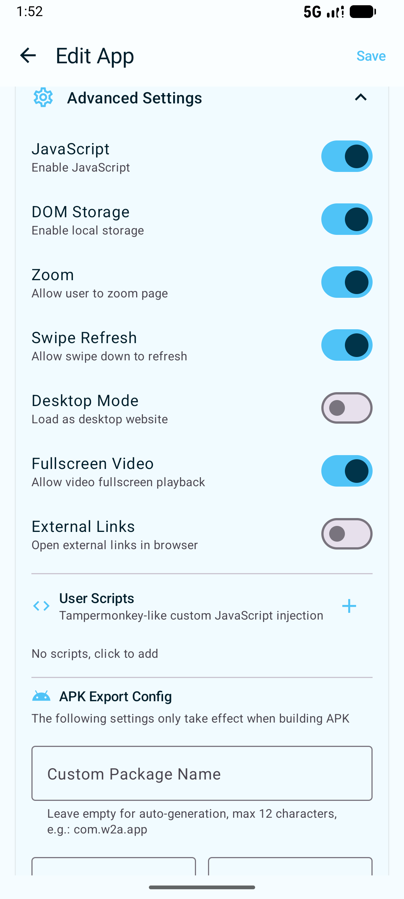
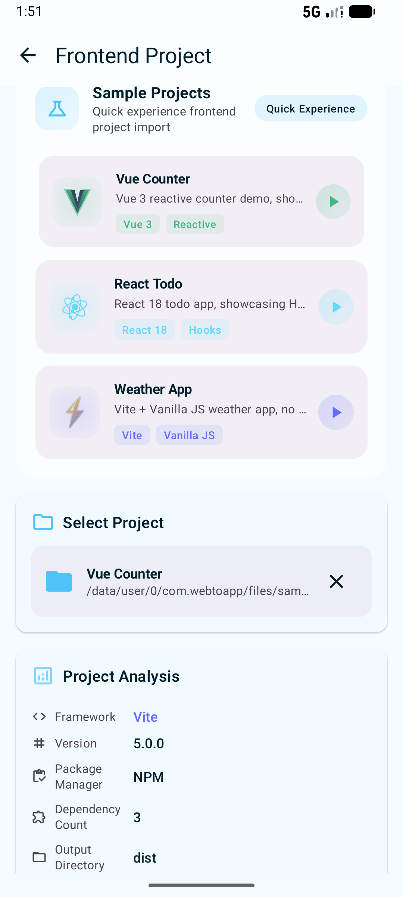
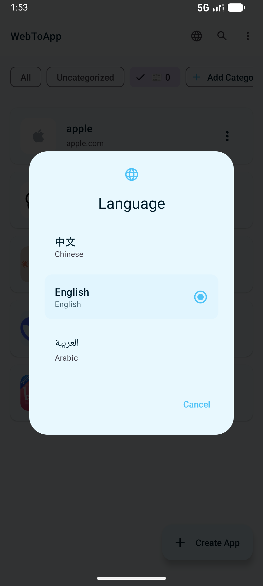
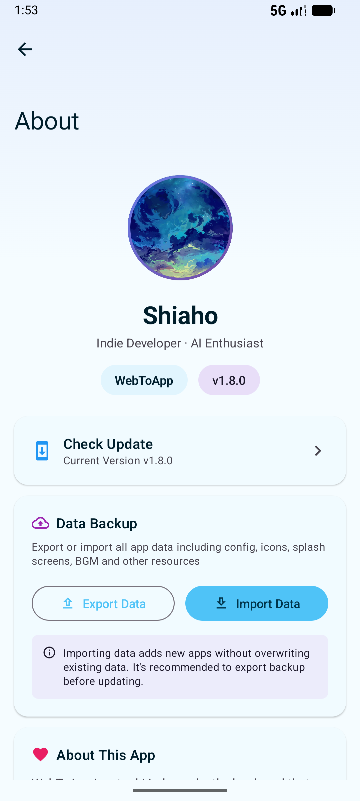

<div align="center">


# WebToApp

### 🚀 秒速将网站转换为 Android 应用

[English](README.md) | **简体中文**

<p>
  <a href="https://github.com/shiahonb777/web-to-app/stargazers"></a>
  <a href="https://github.com/shiahonb777/web-to-app/network/members"></a>
  <a href="LICENSE"></a>
</p>

<p>
  
  
  
  
</p>

<br/>

> 📱 **无需编程** · 手机上直接构建 APK · **无需 Android Studio**

<br/>

</div>

---

<p align="center">
  <b>🌟 零编程 • 一键构建 • 功能丰富 • 开源免费 🌟</b>
</p>

---

## 📚 目录

<details open>
<summary><b>点击展开/收起</b></summary>

- [✨ 核心亮点](#-核心亮点)
- [📸 应用截图](#-应用截图)
- [🎯 适用场景](#-适用场景)
- [📦 快速开始](#-快速开始)
- [📋 功能特性](#-功能特性)
- [☁️ 云服务 (Pro)](#%EF%B8%8F-云服务-pro)
- [🛠️ 技术栈](#%EF%B8%8F-技术栈)
- [📁 贡献指南](CONTRIBUTING_CN.md)
- [📖 使用指南](#-使用指南)
- [🔧 源码构建](#-源码构建)
- [🧩 扩展模块系统](#-扩展模块系统)
- [📢 公告模板系统](#-公告模板系统)
- [📜 更新日志](CHANGELOG_CN.md)
- [🤝 法律声明](CODE_OF_CONDUCT_CN.md)
- [📬 联系我们](#-联系我们)

</details>

---

## ✨ 核心亮点

<table>
<tr>
<td width="50%">

### 🌐 核心转换
| 功能 | 说明 |
|------|------|
| 🌐 网站转App | 任意网址转独立应用 |
| 🎬 媒体转App | 图片/视频转全屏应用 |
| 💻 HTML转App | 支持 React/Vue/Next.js |
| 📦 一键出包 | 无需 Android Studio |

</td>
<td width="50%">

### 🤖 AI 驱动
| 功能 | 说明 |
|------|------|
| 🧩 扩展模块 | 10个内置 + 28 模板 |
| 🤖 AI 开发 | 用自然语言生成模块代码 |
| 🎨 AI 图标生成 | 自动生成美观图标 |
| 🎵 音乐搜索 | 在线搜索 BGM 和歌词 |

</td>
</tr>
<tr>
<td width="50%">

### 🛡️ 安全与隐私
| 功能 | 说明 |
|------|------|
| 🔐 APK 加密 | AES-256-GCM 保护 |
| 🛡️ 浏览器伪装 | UA 与指纹伪装 |
| 🚫 Hosts 拦截 | 域名级广告拦截 |
| 🌍 隔离环境 | 多实例隔离运行 |

</td>
<td width="50%">

### ✨ 其他功能
| 功能 | 说明 |
|------|------|
| 🖼️ 媒体库 | 内置媒体管理器 |
| 📱 APK 架构 | 支持多架构打包 |
| 📋 长按菜单 | 增强型上下文菜单 |
| 🌐 浏览器内核 | 自定义 WebView 内核 |

</td>
</tr>
<tr>
<td colspan="2">

### ☁️ 云服务 (Pro/Ultra)
| 功能 | 说明 |
|------|------|
| ☁️ 云项目 | 激活码、公告、版本更新、远程配置 |
| 📤 APK 分享页 | 带 GitHub/Gitee 双链接的下载页 |
| 📊 数据看板 | 安装量、活跃用户、设备/国家/版本分布 |
| 🔗 Webhooks | 事件回调，支持 HMAC 签名校验 |
| 💾 云备份 | 备份项目到 GitHub/Gitee 仓库 |
| 📦 双平台发布 | 同时发布到 GitHub Releases + Gitee Releases |

> 💡 **本地功能 100% 开源免费。** 云服务是可选付费功能，用于覆盖服务器成本。

</td>
</tr>
</table>

## 📸 应用截图

<div align="center">
<p>
  
  
  
  
</p>
<p>
  
  
  
  
</p>
<p>
  
  
</p>
</div>

---

## 🎯 适用场景

<table>
<tr>
<td>

| 📱 个人 | 🏢 商业 |
|--------|--------|
| 快速访问网站 | 企业内部系统 |
| 媒体展示应用 | 产品演示应用 |
| 网页增强工具 | 自助终端展示 |
| 隐私保护 | 培训类应用 |

</td>
<td>

| 👨‍💻 开发者 | 👨‍👩‍👧 家庭 |
|-----------|----------|
| 前端项目打包 | 儿童学习应用 |
| H5 游戏打包 | 屏幕时间控制 |
| Web 应用测试 | 教育类应用 |
| 快速原型验证 | 安全浏览 |

</td>
</tr>
</table>

## 📦 快速开始


1️⃣ 克隆仓库
```bash
git clone https://github.com/shiahonb777/web-to-app.git
```

2️⃣ 用 Android Studio 打开
3️⃣ 在设备上运行并构建
4️⃣ 开始把网站转换成应用

> 💡 **也可以直接从 [Releases](https://github.com/shiahonb777/web-to-app/releases) 下载 APK。**

---

## 📋 功能特性

<details>
<summary><b>🌐 核心功能</b>（点击展开）</summary>

- **网址转 App**：输入任意网站地址即可生成独立应用
- **媒体转 App**：把图片/视频转换成独立应用
- **HTML 转 App**：把 HTML/CSS/JS 项目转换成独立应用
- **前端框架支持**：React、Vue、Next.js、Nuxt、Svelte 一键打包
- **服务端应用**：支持 Node.js、PHP、Python、Go、WordPress 项目
- **图集应用**：从多张图片/视频创建展示应用
- **自定义图标**：从相册选择或用 AI 生成
- **自定义名称**：自由修改应用显示名
- **自定义包名**：支持自定义 APK 包名和版本号

</details>

<details>
<summary><b>🧩 扩展模块系统</b></summary>

- **类 Tampermonkey 脚本**：向网页注入自定义 JavaScript/CSS
- **10 个内置模块**：视频下载、B站/抖音/小红书提取、视频增强、网页分析、深色模式、隐私保护、内容增强、元素屏蔽
- **28 个代码模板**：快速创建常见功能模块
- **模块分类**：23 类（内容过滤、内容增强、样式修改、主题、功能增强、自动化、导航、数据提取、数据保存、交互、无障碍、媒体、视频、图片、音频、安全、反追踪、社交、购物、阅读、翻译、开发工具、其他）
- **URL 匹配规则**：支持通配符和正则
- **配置系统**：模块可自定义设置
- **权限声明**：细粒度权限控制
- **分享代码**：一键生成分享码/二维码
- **导入导出**：支持模块文件导入与导出
- **Chrome 扩展支持**：导入并运行 Chrome 扩展，自动适配桌面到移动端
- **Userscript 支持**：导入 Greasemonkey/Tampermonkey 脚本

</details>

<details>
<summary><b>🤖 AI 模块开发代理</b></summary>

- **自然语言开发**：用自然语言描述需求，AI 生成模块代码
- **语法检查**：自动检测 JavaScript/CSS 语法错误
- **安全扫描**：检测 XSS、eval 等安全问题
- **自动修复**：AI 自动修复已发现的问题
- **代码片段库**：快速插入常用代码
- **调试测试页**：内置测试页验证模块效果

</details>

<details>
<summary><b>🎨 AI 功能</b></summary>

- **多模型支持**：Google Gemini、OpenAI、GLM、Volcano、MiniMax、OpenRouter 等
- **AI HTML 编码**：辅助生成 HTML/CSS/JS 代码
- **AI 图标生成器**：使用 AI 生成应用图标
- **图标库**：收集和管理生成结果
- **会话管理**：支持多会话、模板、风格自定义
- **实时预览**：实时查看生成代码效果
- **AI 设置**：统一管理 API Key 和模型

</details>

<details>
<summary><b>✨ 集成功能</b></summary>

- **启动画面**：支持图片/视频启动动画，内置视频裁剪
- **背景音乐**：支持 BGM 播放列表和 LRC 歌词同步
- **在线音乐搜索**：在线搜索并下载带歌词的 BGM
- **激活码**：内置激活机制，支持 SHA-256 加密校验
- **公告**：启动时展示公告并支持链接
- **公告模板**：10 套精美模板（小红书、渐变、毛玻璃、霓虹等）
- **广告拦截**：内置广告拦截引擎，过滤网页广告和弹窗
- **Hosts 拦截**：支持自定义 hosts 文件进行域名级过滤
- **网页自动翻译**：自动翻译网页，支持中/英/日/阿拉伯语
- **浏览器内核**：支持 WebView 和 GeckoView 双内核切换
- **浏览器防护**：跟踪器拦截、HTTPS 自动升级、Cookie 同意拦截、阅读模式
- **浏览器伪装**：UA 和浏览器指纹伪装
- **隔离浏览器环境**：每个应用独立运行环境，支持指纹伪装与多实例隔离
- **长按菜单**：增强型长按菜单，支持自定义操作
- **后台运行**：退出后继续后台执行任务
- **强制运行模式**：定时强制运行，屏蔽 Home/Back，黑科技功能
- **自启动**：支持开机自启和定时自启
- **APK 加密**：配置/代码/媒体加密、完整性检查、反调试保护
- **广告接入**：预留广告 SDK 接口（横幅/插页/开屏）

</details>

<details>
<summary><b>📤 导出选项</b></summary>

- **桌面快捷方式**：创建桌面图标，像原生应用一样启动
- **构建 APK**：无需 Android Studio 也能生成独立 APK
- **APK 架构**：可选 arm64-v8a、armeabi-v7a、x86、x86_64
- **项目模板**：导出完整 Android Studio 项目

</details>

<details>
<summary><b>🛡️ APK 加固</b></summary>

- **加固引擎**：一键加固保护
- **反编译防护**：阻止反编译和逆向分析
- **Dex 保护**：Dex 文件加密保护
- **代码混淆**：代码混淆处理
- **原生保护**：Native 层安全防护
- **运行时防护**：反调试、环境检测
- **完整性校验**：防篡改校验

</details>

<details>
<summary><b>🎥 媒体应用功能</b></summary>

- **图片转 App**：全屏图片展示，支持铺满屏幕
- **视频转 App**：支持循环、静音/音频开关、自动播放、大视频流
- **媒体库**：内置媒体管理与浏览
- **显示配置**：音频开关、循环、自动播放、铺满屏幕
- **加密支持**：媒体文件支持加密保护
- **APK 导出**：媒体应用可直接导出 APK

</details>

<details>
<summary><b>🎨 主题系统</b></summary>

- **多种主题**：内置多套美观主题
- **深色模式**：跟随系统或手动切换
- **动画效果**：可调节动画样式和速度
- **粒子效果**：部分主题支持粒子背景

</details>

<details>
<summary><b>⚡ 应用修改器</b></summary>

- **应用扫描**：自动扫描已安装应用
- **图标/名称修改**：自由修改任意应用的图标和名称
- **克隆安装**：安装带独立包名的修改版应用
- **快捷方式启动**：创建新图标快捷方式启动原应用

</details>

---

<div align="center">

| 分类 | 技术 |
|:----:|:-----|
| 📝 语言 | Kotlin 1.9+ |
| 🎨 UI | Jetpack Compose + Material 3 |
| 🏗️ 架构 | MVVM + Repository |
| 🗄️ 数据库 | Room + DataStore |
| 🌐 网络 | OkHttp |
| 🖼️ 图片 | Coil |
| 🌍 浏览器内核 | WebView + GeckoView (Firefox) |
| 🔐 加密 | AES-256-GCM + PBKDF2 |
| ✍️ 签名 | apksig (v1/v2/v3) |
| 🛡️ Native | CMake C++17 / NDK |
| 📷 二维码 | ZXing |
| 🌍 多语言 | i18n 动态切换 |
| 📱 最低版本 | Android 6.0 (API 23) |
| 🎯 目标版本 | Android 16 (API 36) |

</div>

## 📖 使用说明

### 创建网站应用
1. 点击主页的 "创建应用" 按钮
2. 填写应用名称和网站地址
3. （可选）选择自定义图标或使用 AI 生成
4. （可选）配置启动画面、背景音乐、激活码、公告、广告拦截等
5. （可选）选择扩展模块增强功能
6. 点击保存

### 创建媒体应用
1. 点击 "创建媒体应用" 按钮
2. 选择图片或视频文件
3. 配置显示选项（循环播放、自动播放、音频开关等）
4. （可选）添加背景音乐
5. 保存并构建 APK

### 创建 HTML 应用
1. 点击 "创建 HTML 应用" 按钮
2. 选择 HTML 项目文件夹或单个文件
3. 设置入口文件（默认 index.html）
4. 支持 React/Vue/Next.js 等构建产物
5. 保存并构建 APK

### 使用扩展模块
1. 在创建/编辑应用时，展开"扩展模块"卡片
2. 点击"选择模块"浏览 10 个内置模块
3. 选择需要的模块（视频下载、深色模式、隐私保护等）
4. 模块会在应用运行时自动注入执行

### AI 辅助开发
1. 进入"扩展模块" > "AI 模块开发"
2. 用自然语言描述你想要的功能
3. AI 自动生成模块代码并进行语法检查和安全扫描
4. 预览效果并保存

### 运行应用
- 点击应用卡片直接预览运行
- 长按或点击菜单可进行更多操作

### 构建 APK 安装包
1. 点击应用卡片右侧菜单 > "构建 APK"
2. 配置加密选项（可选）
3. 配置独立浏览器环境（可选）
4. 配置后台运行（可选）
5. 点击 "开始构建"
6. 构建完成后自动弹出安装界面

### 配置强制运行模式
1. 在创建/编辑应用时，展开"强制运行"卡片
2. 启用强制运行并选择模式（固定时段/倒计时/限时）
3. 配置时间段和生效日期
4. 配置黑科技功能（可选）
5. 构建 APK 后应用将在指定时间强制运行

### 使用应用修改器
1. 点击主页右上角菜单 > "应用修改器"
2. 在应用列表中搜索或筛选目标应用
3. 点击应用进入修改界面
4. 选择新图标、输入新名称
5. 选择操作方式：
   - **快捷方式**：创建使用新图标的桌面快捷方式
   - **克隆安装**：生成新 APK 并安装为独立应用

## 技术栈

| 类别 | 技术 |
|------|------|
| 语言 | Kotlin 1.9+ |
| UI | Jetpack Compose + Material 3 |
| 架构 | MVVM + Repository |
| 数据 | Room + DataStore |
| 网络 | OkHttp |
| 原生 | CMake C++17 / NDK |

## 多语言结构

- `app/src/main/java/com/webtoapp/core/i18n/Strings.kt`
  现在主要保留兼容门面、语言状态和上下文绑定。
- `app/src/main/java/com/webtoapp/core/i18n/strings`
  文案已按职责拆成多个子文件，包括通用 UI、创建/项目流程、云端/社区、AI/AI 编码/AI 配置、模块/扩展、Shell/WebView、代码片段/商店/计费、音乐/构建/UI，以及历史兼容补丁分组。

## 编译说明

### 环境要求
- Android Studio Hedgehog (2023.1.1) 或更高版本
- JDK 17
- Gradle 8.14+

### 编译步骤
```bash
# 克隆项目
git clone <repository_url>

# 进入项目目录
cd 网站转app

# 编译Debug版本
./gradlew assembleDebug

# 编译Release版本
./gradlew assembleRelease
```

### 签名配置
Release版本需要配置签名，在 `app/build.gradle.kts` 中添加：
```kotlin
signingConfigs {
    create("release") {
        storeFile = file("your-keystore.jks")
        storePassword = "your-store-password"
        keyAlias = "your-key-alias"
        keyPassword = "your-key-password"
    }
}
```

## 扩展模块系统

### 内置模块
| 模块 | 功能 |
|------|------|
| ⬇️ 视频下载器 | 自动检测网页视频，支持 MP4 和 Blob 流下载 |
| 📺 B站视频提取 | 提取 B站最高画质视频和音频流地址 |
| 🎬 抖音视频提取 | 提取抖音无水印视频地址 |
| 📱 小红书视频提取 | 提取小红书视频播放地址 |
| ⚡ 视频增强 | 倍速控制（0.5x-5x）、画中画、后台播放、阻止App跳转 |
| 🔧 网页分析工具 | 元素审查、网络监控、Cookie管理、Console注入 |
| 🌙 高级暗黑模式 | 智能色彩反转、图片亮度控制、定时开关 |
| 🛡️ 隐私保护 | 去广告、反指纹追踪、点击劫持保护、外链警告 |
| 📝 内容增强 | 强制复制、划词翻译、长截图、Markdown转化 |
| 🚫 元素屏蔽 | 屏蔽网页广告、弹窗、指定元素 |

### 模块分类（23种）
- 内容过滤、内容增强、样式修改、主题美化
- 功能增强、自动化、导航辅助、数据提取
- 数据保存、交互、无障碍
- 媒体处理、视频、图片、音频
- 安全隐私、反追踪、社交增强、购物助手
- 阅读模式、翻译工具、开发调试、其他

### NativeBridge API（原生能力）
扩展模块可以通过 `window.NativeBridge` 调用 Android 原生功能：

| API | 功能 |
|-----|------|
| `showToast(msg, duration?)` | 显示 Toast 提示 |
| `vibrate(ms?)` | 触发震动反馈 |
| `vibratePattern(pattern, repeat?)` | 模式震动 |
| `copyToClipboard(text)` | 复制到剪贴板 |
| `getClipboardText()` | 读取剪贴板内容 |
| `share(title, text, url?)` | 调用系统分享 |
| `shareImage(imageUrl, title?)` | 分享图片 |
| `openUrl(url)` | 用浏览器打开链接 |
| `openApp(packageName)` | 打开其他应用 |
| `saveImageToGallery(url, filename?)` | 保存图片到相册 |
| `saveVideoToGallery(url, filename?)` | 保存视频到相册 |
| `getDeviceInfo()` | 获取设备信息（JSON） |
| `getAppInfo()` | 获取应用信息（JSON） |
| `isNetworkAvailable()` | 检查网络状态 |
| `getNetworkType()` | 获取网络类型 |
| `saveToFile(content, filename, mimeType?)` | 保存文件 |
| `log(message)` | 输出日志 |
| `setOrientation(orientation)` | 设置屏幕方向 |
| `getOrientation()` | 获取当前屏幕方向 |
| `lockOrientation()` | 锁定屏幕方向 |
| `unlockOrientation()` | 解锁屏幕方向 |
| `downloadVideo(url, filename)` | 下载视频 |
| `downloadWithHeaders(url, filename, headersJson)` | 带 Headers 下载 |
| `setScreenBrightness(brightness)` | 设置屏幕亮度 |
| `setKeepScreenOn(keepOn)` | 保持屏幕常亮 |
| `enterFullscreen()` | 进入全屏模式 |
| `exitFullscreen()` | 退出全屏模式 |
| `isFullscreen()` | 检查全屏状态 |

## 公告模板

内置 10 种精美公告弹窗模板：
- **极简风格** - 简洁大方
- **小红书风格** - 活泼可爱
- **渐变风格** - 现代时尚
- **毛玻璃风格** - 通透质感
- **霓虹风格** - 炫酷发光
- **可爱风格** - 粉嫩甜美
- **优雅风格** - 金色高贵
- **节日风格** - 喜庆热闹
- **暗黑风格** - 神秘深邃
- **自然风格** - 清新绿色

## 广告拦截规则

内置常见广告域名拦截，支持自定义规则：
- 域名规则：`||example.com` 或直接输入域名
- 通配符规则：`*ads*`、`*/banner/*`

## 激活码机制

- 支持批量设置多个激活码
- 激活状态本地持久化
- 支持SHA-256加密校验

## 注意事项

1. 部分网站可能有反爬虫机制，加载可能受限
2. 需要网络权限才能正常使用
3. 导出的项目需要在PC端用Android Studio编译
4. 激活码支持本地验证和云端验证（Pro/Ultra）
5. 扩展模块在 WebView 中执行，部分网站可能有 CSP 限制
6. 云服务需要有效的 Pro/Ultra 订阅；所有本地功能永久免费

## License

The Unlicense

## 联系作者

本应用由作者（shiaho）独立开发，有任何问题都可以找我！

### 📱 社交媒体

| 平台 | 账号 | 链接 |
|------|------|------|
| **X (Twitter)** | @shiaho777 | [x.com/@shiaho777](https://x.com/@shiaho777) |
| **Telegram** | webtoapp777 | [t.me/webtoapp777](https://t.me/webtoapp777) |
| **GitHub** | shiahonb777 | [github.com/shiahonb777/web-to-app](https://github.com/shiahonb777/web-to-app) |
| **Bilibili** | 视频教程 | [b23.tv/8mGDo2N](https://b23.tv/8mGDo2N) |

### 💬 交流群

| 平台 | 群号/链接 | 说明 |
|------|----------|------|
| **QQ群** | 1041130206 | 作者每天互动，发布更新消息和最新安装包 |
| **Telegram群** | [t.me/webtoapp777](https://t.me/webtoapp777) | 国际用户交流群 |

### 📧 联系方式

| 方式 | 账号 |
|------|------|
| **作者QQ** | 2711674184 |
| **QQ邮箱** | 2711674184@qq.com |
| **Gmail** | weuwo479@gmail.com |
