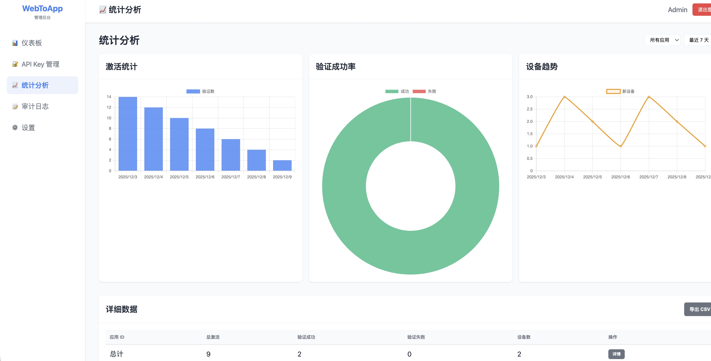
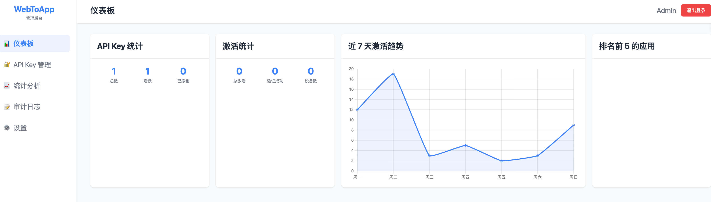
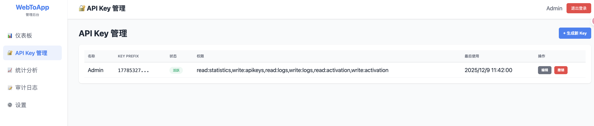
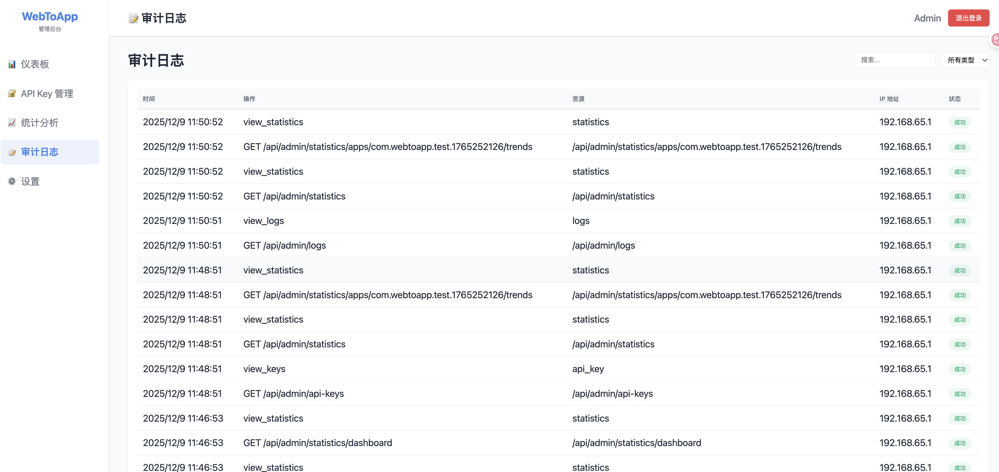

# WebToApp Key Server 🔐

**远程激活码验证服务 + 管理后台**

一个完整的激活码管理系统，为 WebToApp 提供远程验证、管理和审计功能。采用 Go + SQLite 实现，支持 Docker 部署，内置管理后台和完整的 API 文档。

---

## ✨ 核心功能

### 🎯 激活码管理
- ✅ **批量生成激活码** - 灵活配置过期时间、使用次数、设备限制
- ✅ **远程激活验证** - 客户端调用 API 验证激活码
- ✅ **撤销管理** - 随时撤销已生成的激活码
- ✅ **设备限制** - 单个激活码支持多设备，可设置上限

### 🔒 安全特性
- ✅ **API Key 认证** - 采用 Bearer Token 方案
- ✅ **签名验证** - HMAC-SHA256 请求签名
- ✅ **时间戳防重放** - 防止重放攻击
- ✅ **审计日志** - 记录所有管理操作和 API 调用
- ✅ **权限控制** - 基于 API Key 的细粒度权限管理

### 📊 管理后台
- ✅ **Web 管理界面** - 直观的激活码管理和查看
- ✅ **实时统计** - 显示激活码使用统计和设备信息
- ✅ **API Key 管理** - 创建、更新、撤销 API Key
- ✅ **审计日志查看** - 完整的操作日志和审计追踪

### 🌐 API 接口
- ✅ **RESTful API** - 标准的 HTTP API 接口
- ✅ **激活码操作** - 生成、验证、列表、撤销
- ✅ **统计数据** - 获取使用统计、趋势数据
- ✅ **日志查询** - 查询审计日志和操作记录

---

## 📋 系统架构

```
┌─────────────────────────────────────────────────────┐
│          Web Admin Dashboard (Vue/React)             │
├─────────────────────────────────────────────────────┤
│                                                       │
│  ┌────────────────────────────────────────────────┐  │
│  │        Go Backend (Gin Framework)              │  │
│  ├────────────────────────────────────────────────┤  │
│  │  • API Key Auth Middleware                     │  │
│  │  • Audit Logger Middleware                     │  │
│  │  • CORS & Error Handling                       │  │
│  └────────────────────────────────────────────────┘  │
│                                                       │
│  ┌────────────────────────────────────────────────┐  │
│  │      Services Layer (Business Logic)          │  │
│  │  • ActivationService                          │  │
│  │  • APIKeyService                              │  │
│  │  • StatisticsService                          │  │
│  └────────────────────────────────────────────────┘  │
│                                                       │
│  ┌────────────────────────────────────────────────┐  │
│  │      SQLite Database (keyserver.db)           │  │
│  │  • activation_codes                           │  │
│  │  • api_keys                                   │  │
│  │  • audit_logs                                 │  │
│  │  • statistics                                 │  │
│  └────────────────────────────────────────────────┘  │
│                                                       │
└─────────────────────────────────────────────────────┘
```

---

## 🚀 快速开始

### 前置要求

- **Go 1.24+** （已在 Docker 镜像中预装）
- **Docker & Docker Compose** （推荐）
- **SQLite 3** （嵌入在应用中）

### 方式 1: Docker Compose（推荐）

最简单快速的方式，一条命令启动完整服务：

```bash
# 克隆项目
git clone https://github.com/yingcaihuang/webtoapp-key-server.git
cd webtoapp-key-server

# 生成自签名 SSL 证书（用于 HTTPS）
mkdir -p docker/certs
openssl req -x509 -newkey rsa:4096 -keyout docker/certs/key.pem -out docker/certs/cert.pem \
  -days 365 -nodes -subj "/CN=localhost"

# 启动所有服务（Backend + Nginx + DB）
docker-compose up -d

# 查看日志（包含默认 Admin API Key）
docker-compose logs keyserver | grep "完整 Key"
```

**访问地址：**
- 🌐 Web 管理后台：https://localhost （使用生成的 Admin API Key 登录）
- 🔌 后端 API：https://localhost/api
- 📝 健康检查：https://localhost/api/health

### 方式 2: 本地开发

```bash
# 安装依赖
go mod download

# 构建应用
go build -o keyserver ./cmd/main.go

# 运行
./keyserver

# 应用启动在 http://localhost:8080
```

---

## 🔑 API 文档

### 认证方式

所有需要认证的 API 都使用 **Bearer Token** 方案：

```bash
Authorization: Bearer {API_KEY}
```

**获取 API Key：**
1. 首次启动时，系统自动生成一个默认 `Admin` API Key
2. 查看日志：`docker-compose logs keyserver | grep "完整 Key"`
3. 在管理后台创建新的 API Key

### 激活码 API

#### 1️⃣ 生成激活码 ✅ 需要认证

```bash
POST /api/activation/generate
Authorization: Bearer {API_KEY}
Content-Type: application/json

{
  "app_id": "com.example.app",
  "count": 10,
  "expires_in_days": 30,
  "max_uses": 5,
  "device_limit": 3
}
```

**参数说明：**
- `app_id` (string, 必需) - 应用 ID
- `count` (int, 必需) - 生成个数（1-1000）
- `expires_in_days` (int, 可选) - 过期天数（默认 30）
- `max_uses` (int, 可选) - 最大使用次数（默认 10）
- `device_limit` (int, 可选) - 设备限制数（默认 5）

**响应示例：**
```json
{
  "success": true,
  "generated": 10,
  "codes": [
    {
      "code": "7b89-0e9--aa4--3cb-",
      "id": 1,
      "expires_at": 1767844455712
    },
    ...
  ]
}
```

#### 2️⃣ 验证激活码 ✅ 公开（无需认证）

```bash
POST /api/activation/verify
Content-Type: application/json

{
  "code": "7b89-0e9--aa4--3cb-",
  "app_id": "com.example.app",
  "device_id": "device_123",
  "device_info": {
    "device_name": "iPhone 13",
    "model": "iPhone",
    "os_version": "15.0",
    "app_version": "1.0.0"
  },
  "timestamp": 1702116000000
}
```

**响应示例：**
```json
{
  "success": true,
  "message": "Activation successful",
  "data": {
    "activation_id": 1,
    "devices_used": 1,
    "device_limit": 3,
    "expires_at": 1767844455712,
    "remaining_uses": 4
  }
}
```

#### 3️⃣ 列表查询 ✅ 需要认证

```bash
GET /api/activation/list?app_id=com.example.app&page=1&limit=20
Authorization: Bearer {API_KEY}
```

**响应示例：**
```json
{
  "success": true,
  "total": 100,
  "page": 1,
  "limit": 20,
  "items": [
    {
      "id": 1,
      "code": "7b89-0e9--aa4--3cb-",
      "app_id": "com.example.app",
      "status": "active",
      "created_at": "2025-12-09T03:00:00Z",
      "expires_at": "2025-01-08T03:00:00Z"
    },
    ...
  ]
}
```

#### 4️⃣ 撤销激活码 ✅ 需要认证

```bash
DELETE /api/activation/{app_id}/{code}
Authorization: Bearer {API_KEY}
```

**响应示例：**
```json
{
  "success": true,
  "message": "Activation code revoked successfully"
}
```

### 健康检查

```bash
GET /api/health
```

---

## 🖼️ 功能截图

### 登录页面 - 显示默认 Admin Key



### 激活码管理界面



### API Key 管理



### 审计日志



---

## 📂 项目结构

```
webtoapp-key-server/
├── cmd/
│   └── main.go                 # 应用入口
├── internal/
│   ├── api/
│   │   ├── handlers/           # HTTP 请求处理器
│   │   ├── middleware/         # 中间件（认证、日志、CORS等）
│   │   └── router.go           # 路由配置
│   ├── config/                 # 配置管理
│   ├── database/               # 数据库操作
│   │   ├── db.go              # 数据库初始化
│   │   └── seeder.go          # 初始化数据
│   ├── domain/                 # 数据模型
│   └── service/                # 业务逻辑
├── docker/
│   ├── Dockerfile              # Docker 镜像配置
│   ├── entrypoint.sh           # 容器启动脚本
│   └── nginx/
│       └── conf.d/
│           └── default.conf    # Nginx 反向代理配置
├── web/                        # 前端 Web 管理后台
│   ├── index.html
│   ├── login.html
│   ├── css/
│   ├── js/
│   └── libs/                   # 前端库（Chart.js 等）
├── configs/                    # 配置文件
├── docker-compose.yml          # Docker Compose 配置
├── go.mod & go.sum             # Go 依赖管理
└── README.md                   # 本文档
```

---

## 🔐 安全性

### 认证方案

所有管理类 API 都采用 **Bearer Token + API Key** 认证：

```
┌──────────────────────────────────────────┐
│      Client Request (with API Key)       │
└──────────────────────────────────────────┘
              ↓
┌──────────────────────────────────────────┐
│    APIKeyAuth Middleware                 │
│ • 验证 Authorization header              │
│ • 检查 API Key 是否有效                  │
│ • 检查 API Key 权限                      │
└──────────────────────────────────────────┘
              ↓
┌──────────────────────────────────────────┐
│    Request Passed ✅                     │
│    记录审计日志                          │
│    执行业务逻辑                          │
└──────────────────────────────────────────┘
```

### 权限模型

每个 API Key 可配置以下权限：

- `read:statistics` - 读取统计数据
- `write:apikeys` - 管理 API Keys
- `read:logs` - 查看审计日志
- `write:logs` - 修改日志
- `read:activation` - 查看激活码
- `write:activation` - 生成/撤销激活码

### 安全特性

- 🔒 **API Key 存储** - 采用 SHA256 哈希存储，不存储明文
- 🔐 **HTTPS** - 所有通信都通过 HTTPS 加密
- 📝 **审计日志** - 完整的操作审计和日志
- ⏰ **时间戳验证** - 防止重放攻击
- 🛡️ **CORS 安全** - 配置的跨域策略

---

## 📊 数据库架构

### 激活码表 (activation_codes)

```sql
CREATE TABLE activation_codes (
  id INTEGER PRIMARY KEY,
  code TEXT UNIQUE,
  app_id TEXT,
  status TEXT,                 -- 'active', 'expired', 'revoked'
  max_uses INTEGER,
  current_uses INTEGER,
  device_limit INTEGER,
  created_at TIMESTAMP,
  expires_at TIMESTAMP
);
```

### API Keys 表 (api_keys)

```sql
CREATE TABLE api_keys (
  id INTEGER PRIMARY KEY,
  name TEXT,
  key_prefix TEXT,             -- 用于日志和界面显示
  key_hash TEXT,               -- 实际的密钥哈希
  permissions TEXT,            -- JSON 格式的权限列表
  status TEXT,                 -- 'active', 'revoked'
  created_at TIMESTAMP,
  last_used_at TIMESTAMP
);
```

### 审计日志表 (audit_logs)

```sql
CREATE TABLE audit_logs (
  id INTEGER PRIMARY KEY,
  api_key_id INTEGER,
  action TEXT,                 -- 'CREATE', 'UPDATE', 'DELETE', 'VERIFY'
  resource TEXT,               -- 操作的资源类型
  resource_id TEXT,
  status TEXT,                 -- 'success', 'failed'
  details TEXT,                -- JSON 格式的详细信息
  created_at TIMESTAMP
);
```

---

## 🧪 测试

### 运行测试脚本

```bash
# 完整集成测试
sh ./test_api_simple.sh

# Python 测试脚本
python3 test_api.py

# 单个 Shell 测试
bash test_api.sh
```

### 测试覆盖

- ✅ 健康检查
- ✅ 激活码生成
- ✅ 激活码验证
- ✅ 列表查询
- ✅ 撤销操作
- ✅ 多设备支持
- ✅ 权限验证
- ✅ 错误处理

---

## 🌍 环境变量

在 `.env` 文件中配置（可选）：

```env
# 应用设置
APP_PORT=8080
APP_ENV=production              # development 或 production
DEBUG=false

# 数据库
DB_PATH=./data/keyserver.db

# Signature Secret（用于请求签名）
SIGNATURE_SECRET=your-secret-key

# 是否跳过默认 Admin Key 生成
SKIP_DEFAULT_ADMIN_KEY=false
```

---

## 📝 常见问题 (FAQ)

### Q: 如何重置管理员密码？
**A:** 当前版本不存储密码，使用 API Key 进行认证。重置 API Key：
```bash
# 删除数据库
rm data/keyserver.db

# 重启应用（会生成新的默认 Admin Key）
docker-compose restart keyserver
```

### Q: 如何创建新的 API Key？
**A:** 使用管理后台：
1. 用默认 Admin Key 登录
2. 进入 "API Keys" 管理页面
3. 点击 "创建新 Key"
4. 设置权限并保存

### Q: 激活码多久过期？
**A:** 默认 30 天，可在生成时自定义 `expires_in_days` 参数。

### Q: 支持多少个并发请求？
**A:** SQLite 在高并发下会有限制。建议升级到 PostgreSQL 以支持更高的并发。

### Q: 数据如何备份？
**A:** 直接复制 `data/keyserver.db` 文件即可备份。

---

## 🚢 生产部署

### SSL 证书配置

使用自签名证书（测试）或真实证书（生产）：

```bash
# 使用 Let's Encrypt 生成真实证书
certbot certonly --standalone -d your-domain.com

# 复制到项目目录
cp /etc/letsencrypt/live/your-domain.com/fullchain.pem docker/certs/cert.pem
cp /etc/letsencrypt/live/your-domain.com/privkey.pem docker/certs/key.pem

# 重启服务
docker-compose restart nginx
```

### Nginx 反向代理

已内置在 `docker/nginx/conf.d/default.conf` 中，支持：
- HTTP → HTTPS 重定向
- 静态文件缓存
- API 路由转发
- 安全头配置

---

## 🤝 贡献

欢迎提交 Issue 和 Pull Request！

---

## 📄 许可证

MIT License - 详见 [LICENSE](./LICENSE) 文件

---

## 📞 联系我们

- 📧 Email: support@webtoapp.com
- 🐛 Issues: [GitHub Issues](https://github.com/yingcaihuang/webtoapp-key-server/issues)
- 📚 Wiki: [项目 Wiki](https://github.com/yingcaihuang/webtoapp-key-server/wiki)

---

## 更新日志

### v1.0.0 (2025-12-09)
- ✨ 初始版本发布
- ✅ 完整的激活码管理系统
- ✅ Web 管理后台
- ✅ RESTful API
- ✅ 审计日志
- ✅ Docker 部署支持
